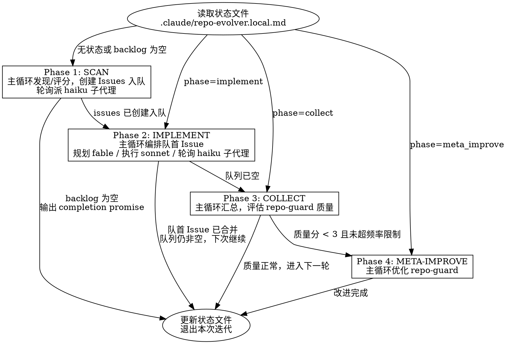

# Repo Evolver

自主仓库改进循环。读取状态文件，执行当前阶段，推进状态机，每次迭代完成一个改进。

<HARD-GATE>
在创建 GitHub Issue 并等待 repo-guard 评论之前，禁止修改任何项目代码文件。
在 Issue 创建并评估 repo-guard 反馈之前，禁止创建分支、编写方案或执行实现。
违反此规则等同于跳过测试直接提交——无论改进多么"显而易见"，都必须走完整流程。
</HARD-GATE>

## 红线

- 不经过 Issue 直接修改代码 → 违规。立即停止，回退到 Phase 1。
- 不等 repo-guard 评论就开始实现 → 违规。必须轮询等待或超时后才能继续。
- 跳过 PR 直接 commit 到默认分支 → 违规。所有变更必须通过 PR。
- "这个改动太小不需要走流程" → 不存在这种例外。所有改动走完整五阶段。

## 触发信号

- "审视这个仓库并持续改进"
- "自主发现和修复问题"
- "evolve this repo"
- 被 ralph-loop 重复喂入时自动恢复执行

不适用于：单次代码评审、手动指定的 bugfix、不涉及 GitHub 的本地修改。

## 状态机

## 工作流程

### 启动

1. 读取 `references/state-schema.md` 了解状态文件格式。
2. 读取 `.claude/repo-evolver.local.md`。如果不存在，创建初始状态（phase: scan, backlog: []）。
3. 根据当前 phase 跳转到对应阶段。

### 执行模型

**每次调用只执行当前 phase，完成后更新状态文件并退出。** 不要在一次调用中连续执行多个 phase。

- ralph-loop 模式：stop-hook 会重新喂入 prompt，下次调用自动进入下一个 phase。
- 单次调用模式：执行完当前 phase 后停止，用户下次调用时继续。

这意味着：Phase 1 结束后退出，Phase 2 在下次调用时执行，以此类推。这确保每个 phase 之间有明确的状态持久化点，且 repo-guard 有时间产生评论。

### 模型分配（串行子代理）

**一次只处理一个 issue，不并行。** 模型分层靠**串行派发子代理**实现：主循环（编排者）需要不同模型干活时，派一个子代理、阻塞等它返回、再派下一个——任意时刻最多 1 个子代理在跑。这样既能按角色切模型，又没有任何并行。

**并发上限 1，且不用 worktree。** 串行不会有文件冲突，所有子代理与主循环共用同一工作目录、同一分支；派发时**不要传 `isolation: "worktree"`**，**不要传 `run_in_background: true`**。

| 角色 | 模型 | 职责 |
|------|------|------|
| 主循环（编排/判断） | 继承会话（应为强档：fable，下线时 opus） | SCAN 发现与评分、IMPLEMENT 编排 + 审评取舍 + 合并决策、COLLECT 质量评估、META-IMPROVE 诊断 |
| 方案规划子代理 | `fable` | 在工作目录内探索代码，用 writing-plans 产出技术方案 |
| 任务执行子代理 | `sonnet` | 按 plan 逐任务实现、修复 |
| 轮询子代理 | `haiku` | 等 repo-guard 评论、等 CI，到点或超时返回结果原文 |

两条原则：

- **判断不下放**：发现与评分、方案审定、repo-guard 建议取舍、合并决策、meta-improve 诊断必须由主循环完成，禁止交给 sonnet/haiku 子代理。子代理只产出原料（plan、代码、评论原文），由主循环判断。
- **机械必下放**：按 plan 写代码、轮询 API、等 CI 用弱模型；长时间等待一律 haiku。

**不可用兜底**：能力阶梯从弱到强为 `haiku < sonnet < opus < fable`。派发子代理时，若目标模型在状态文件 `unavailable_models` 中，沿阶梯就近取**更强**的可用档传给 `model` 参数；若目标已是最强档（fable）或其上再无可用档，则退到就近**更弱**的可用档。

> 当前 fable5 不可用，`unavailable_models` 含 `fable`。故规划子代理的 `model` 由 fable 解析为 `opus`；sonnet、haiku 不受影响。主循环继承会话模型（fable 下线时通常由运行器以 opus 启动）。fable5 恢复后从 `unavailable_models` 移除即自动恢复，无需改动本文件。

### Phase 1: SCAN + ISSUE

**本阶段只允许读取项目文件和创建 GitHub Issues。禁止修改任何项目代码。**

1. 读取 `references/scan-rubric.md`。
2. 运行项目的 lint、typecheck、test 命令，收集 warnings 和 failures。
3. 使用 GitNexus 查询死代码、高复杂度函数、未使用导出。
4. grep TODO/FIXME/HACK，检查过时依赖。
5. 对每个发现按 scan-rubric 评分，写入 backlog（去重：不重复已有 issue 或已尝试过的改进）。
6. 如果 backlog 为空且无新发现，输出 `<promise>NO_MORE_IMPROVEMENTS</promise>` 终止循环。
7. 取 backlog 中得分最高的 N 个独立项（N = min(backlog 中互不冲突的项数, 3)）。它们将在 Phase 2 中逐个串行实现，不并行。
8. 为每个选中项用 `gh issue create` 创建 GitHub Issue。
9. 派 1 个轮询子代理（`model: "haiku"`）等待 repo-guard 的 issue review 评论：每 30 秒用 `gh api` 轮询一次所有 issue，最多 3 分钟，返回每个 issue 的评论原文（无评论则报告超时）。阻塞等它返回，主循环不自行轮询。
10. 读取 `references/quality-evaluation.md`，主循环对 repo-guard 评论评分，将有价值建议按 issue 编号归类记录为约束条件。
11. 设置 phase=implement，issue_queue=[所有 issue 编号]，记录约束条件，更新状态文件。**然后停止。**

**独立性判定**：两个改进项互不冲突 = 涉及不同文件或不同包。如果两个项涉及同一文件，只选优先级更高的那个。

### Phase 2: IMPLEMENT

**本阶段由主循环编排队首 Issue，串行派发子代理走完 plan → implement → PR → 处理 repo-guard 审评 → 合并 的完整流程。一次调用只处理一个 Issue，任意时刻最多 1 个子代理在跑。**

**REQUIRED SUB-SKILL:** superpowers:writing-plans, superpowers:subagent-driven-development, superpowers:finishing-a-development-branch

1. 读取状态文件中的 `issue_queue`、`current_issue` 和约束条件。
2. 如果 `current_issue` 为空，取 `issue_queue` 队首作为 `current_issue`（从队列中移除该编号）。
3. 创建分支 `improve/{slug}`，记录到 `current_branch`。
4. 派 1 个方案规划子代理（`model: "fable"`，兜底见模型分配节；**不传 worktree、不后台**）：在当前工作目录内探索代码，用 writing-plans 编写技术方案，返回 plan 文件路径。阻塞等它返回。
5. 主循环检查 plan 是否覆盖该 issue 的约束条件。不覆盖则带缺口反馈重新派规划子代理（最多重试 1 次）。
6. 用 subagent-driven-development 执行 plan，**每个 task 子代理显式 `model: "sonnet"`**，逐任务串行实现（一次 1 个），每个 task 跑 lint/test 验证。
7. 主循环用 finishing-a-development-branch 创建 PR（目标分支：默认分支），描述中引用 "Closes #{current_issue}"，PR 编号记录到 `current_pr`。
8. 派 1 个轮询子代理（`model: "haiku"`）等 repo-guard 的 PR review：每 30 秒 `gh api` 轮询，最多 5 分钟，返回评论原文。阻塞等它返回。
9. 主循环逐条判断建议：有效（具体、可操作）→ 派 1 个 sonnet 子代理实施修复并 push 到同一分支；无效（误报、泛泛）→ 记录忽略理由。
10. 派 1 个轮询子代理（`model: "haiku"`）等 CI 结果（`gh pr checks`）。CI 失败时主循环诊断原因，派 sonnet 子代理修复并 push。
11. 同一 task 的 sonnet 子代理连续失败 2 次时，主循环改派 `model: "opus"` 子代理重试一次该 task；仍失败则停止该 issue，在 backlog 标记为 skipped 并记录原因，跳到第 13 步。
12. 审评反馈已处理且 CI 全部通过后，主循环合并 PR。读取 `references/quality-evaluation.md`，对本 PR 的 repo-guard 评论评分并写入 quality_log。
13. 在 backlog 将该 issue 对应项打 `[x]`（或 `[~]` skipped），清空 `current_issue`/`current_pr`/`current_branch`。
14. 如果 `issue_queue` 仍非空：保持 phase=implement（下次调用处理下一个 issue）。如果已空：设置 phase=collect。更新状态文件。**然后停止。**

### Phase 3: COLLECT

**本阶段汇总本批次结果，评估整体 repo-guard 质量。**

1. 读取本批次所有 PR 编号、合并状态和质量分（已在 Phase 2 中逐个写入 quality_log）。
2. 对未能合并或被 skipped 的项，将其编号和原因记入状态文件（下一轮 scan 前优先处理，而不是重新创建 issue）。
3. 计算滚动平均质量分。如果 < 3 且距上次 meta-improve >= 5 次迭代：设置 phase=meta_improve，更新状态文件。**然后停止。**
4. 否则：设置 phase=scan（进入下一轮），更新状态文件。**然后停止。**

### Phase 4: META-IMPROVE

1. 读取 `references/meta-improvement-guide.md`。
2. 诊断 repo-guard 质量问题类别（误报多？遗漏多？泛泛？）。
3. 定位需要修改的文件（repo-guard 的 prompts、skills、或 extra-instructions）。
4. 在 repo-guard 仓库创建分支，实施改进，提 PR。
5. 记录 meta_improvement_count++，设置 phase=scan（进入下一轮扫描）。更新状态文件。**然后停止。**

## 输出契约

本 skill 不产出面向用户的报告。所有产出写入：
- `.claude/repo-evolver.local.md`（状态文件）
- GitHub issues 和 PRs（通过 gh CLI）
- Git commits（通过 subagent-driven-development 逐任务提交）

每次迭代结束时，状态文件必须反映：当前 phase、backlog、quality_log、iteration count。

## 防护边界

- 所有变更必须通过 PR + CI，禁止绕过 PR 直接 commit 到默认分支。
- 不 force-push。不删除分支（除非是自己创建的已合并分支）。
- 不修改项目的 CLAUDE.md 或 .claude/settings。
- Meta-improvement 每 5 次迭代最多触发 1 次。超过限制时跳过 Phase 4，直接回到 Phase 1。
- 不重复尝试已失败的改进。如果某个 backlog 项连续失败 2 次，标记为 skipped 并记录原因。
- 如果 scan 阶段连续 3 次产出空 backlog，输出 completion promise 终止循环。
- 不创建超过 10 个未合并 PR。如果未合并 PR 数量 >= 10，暂停创建新 PR，优先处理已有 PR 的 review 反馈。
- 串行子代理：并发上限 1——派一个子代理就阻塞等它返回，再派下一个，绝不同时跑多个。禁止 `run_in_background: true`，禁止 `isolation: "worktree"`。一次只处理一个 issue，合并后再处理下一个。
- 判断不下放：repo-guard 建议取舍、技术方案审定、合并决策必须由主循环完成，禁止交给 sonnet/haiku 子代理；子代理只产出 plan、代码、评论原文等原料。
- 升级兜底：同一 task 的 sonnet 子代理连续失败 2 次后，主循环必须派 opus 子代理重试一次，不得直接放弃；仍失败才走失败上报流程。
- 模型不可用兜底：派子代理时按能力阶梯 `haiku < sonnet < opus < fable` 就近取更强的可用档传给 `model`（最强档不可用才退更弱档），不得跳到非相邻档。当前 `unavailable_models` 含 `fable`，故 fable 档解析为 opus。
